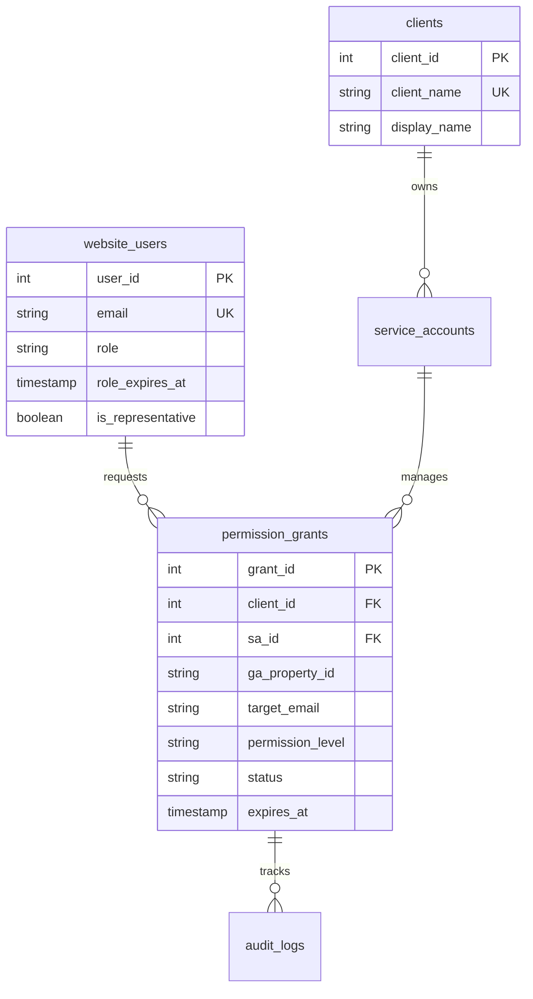

# 제품 요구사항 문서 (PRD): GA4 권한 관리 자동화 시스템

**버전:** 1.0  
**작성일:** 2025년 7월 1일  
**프로젝트명:** GA4 Admin Automation  
**문서 상태:** 최종 승인 대기  

---

## 📋 목차

1. [개요](#1-개요)
2. [목표 및 성공 지표](#2-목표-및-성공-지표)
3. [사용자 페르소나](#3-사용자-페르소나)
4. [핵심 기능 요구사항](#4-핵심-기능-요구사항)
5. [데이터베이스 설계](#5-데이터베이스-설계)
6. [기술 아키텍처](#6-기술-아키텍처)
7. [보안 요구사항](#7-보안-요구사항)
8. [비기능적 요구사항](#8-비기능적-요구사항)
9. [제외 범위](#9-제외-범위)
10. [개발 일정](#10-개발-일정)

---

## 1. 개요

### 1.1 프로젝트 배경

Google Analytics 서비스 파트너사는 여러 고객사의 GA4 계정을 관리하며, 고객사 직원들에게 GA4 접근 권한을 부여하는 업무를 수행합니다. 현재 이 과정은 수동으로 이루어지고 있어 다음과 같은 문제점이 있습니다:

- **운영 비효율성**: 권한 부여/삭제 요청이 증가할 때마다 관리자의 수동 개입 필요
- **보안 위험**: 권한 만료 관리 부재로 인한 불필요한 접근 권한 누적
- **추적성 부족**: 누가 언제 어떤 권한을 부여받았는지 체계적 관리 어려움

### 1.2 솔루션 개요

본 시스템은 **Google Analytics Admin API**를 활용하여 GA4 권한 관리 프로세스를 완전 자동화하는 웹 기반 솔루션입니다.

**핵심 가치 제안:**
- 🚀 **자동화**: Viewer/Analyst 권한은 즉시 자동 승인
- 🔒 **보안**: 모든 권한에 만료일 설정, 자동 삭제
- 📊 **추적성**: 모든 권한 변경 이력 완전 기록
- 🏢 **확장성**: 다중 고객사 관리 지원

---

## 2. 목표 및 성공 지표

### 2.1 비즈니스 목표

| 목표 | 현재 상태 | 목표 상태 | 측정 지표 |
|------|----------|----------|----------|
| 권한 처리 시간 단축 | 평균 24시간 | 5분 이내 | 평균 처리 시간 |
| 관리자 수동 업무 감소 | 100% 수동 | 70% 자동 | 자동 처리율 |
| 보안 강화 | 만료 관리 없음 | 100% 만료 설정 | 만료 설정률 |
| 추적성 확보 | 부분적 기록 | 100% 기록 | 감사 로그 완성도 |

### 2.2 사용자 경험 목표

- **신청자**: 5분 이내 권한 신청 완료 가능
- **관리자**: 일일 관리 업무 시간 80% 단축
- **최종 사용자**: 권한 상태 실시간 알림 수신

---

## 3. 사용자 페르소나

### 3.1 Super Admin (슈퍼 관리자)

**역할:** 시스템의 최고 관리자  
**소속:** GA 서비스 파트너사 담당자  
**주요 업무:**
- 고객사(Client) 및 Service Account 등록/관리
- Editor/Administrator 권한 신청에 대한 최종 승인/거부
- 시스템 정책 설정 및 관리
- 일일 리포트 수신 및 모니터링

**페인 포인트:**
- 수동 승인 요청이 많을 때 처리 지연
- 권한 만료 추적의 어려움

**목표:** 효율적인 권한 관리를 통한 운영 최적화

### 3.2 Requester (신청자)

**역할:** GA 권한 부여를 요청하는 주체  
**소속:** 고객사 직원, 외부 협력업체 등  
**주요 업무:**
- 최초 신청을 통한 신청자 역할 획득 (180일)
- 다른 사용자에게 Viewer/Analyst 권한 부여 요청
- Editor/Administrator 권한 부여 요청
- 신청자 역할 갱신

**페인 포인트:**
- 권한 신청 프로세스의 복잡성
- 승인 상태 추적의 어려움

**목표:** 빠르고 간편한 권한 신청 및 관리

### 3.3 GA User (권한 사용자)

**역할:** 실제 GA4 접근 권한을 부여받는 최종 사용자  
**소속:** 고객사 직원, 마케터, 분석가 등  
**주요 특징:**
- 시스템을 직접 사용하지 않음
- 이메일을 통해 권한 상태 알림 수신

**목표:** 자신의 GA 권한 상태를 명확하게 인지

---

## 4. 핵심 기능 요구사항

### 4.1 사용자 역할 및 생명주기 관리

#### F-1.1 신청자 역할 획득
```
사용자 스토리: 외부 사용자로서, 이름/소속/이메일을 제출하여 권한 신청 자격을 얻고 싶다.
```

**구현 요구사항:**
- 최초 신청 시 자동으로 180일 유효기간의 `Requester` 역할 부여
- 역할 획득 즉시 환영 메일 자동 발송
- `website_users` 테이블에 `role='requester'`, `role_expires_at` 설정

**승인 조건:**
- [ ] 신청 폼 작성 완료 시 5초 이내 역할 부여
- [ ] 환영 메일 발송 성공률 99% 이상
- [ ] 중복 이메일 신청 시 기존 역할 연장 처리

#### F-1.2 신청자 역할 만료 및 알림
```
사용자 스토리: 신청자로서, 내 역할 만료일을 미리 알고 적절히 대응하고 싶다.
```

**구현 요구사항:**
- 만료 30일, 7일, 1일 전 및 당일 알림 메일 발송
- 만료 시 `status='expired'`로 변경 및 삭제 확인 메일 발송
- `last_role_notified_type`으로 중복 알림 방지

#### F-1.3 신청자 역할 자동 갱신
```
사용자 스토리: 만료된 신청자로서, 재신청 시 번거로운 승인 없이 바로 역할을 다시 얻고 싶다.
```

**구현 요구사항:**
- 만료 후 재신청 시 별도 승인 없이 자동 180일 갱신
- 재신청 시 환영 메일 재발송
- 갱신 이력 `audit_logs`에 기록

### 4.2 GA 권한 신청 및 부여 워크플로우

#### F-2.1 자동 승인 권한 신청 (Viewer/Analyst)
```
사용자 스토리: 신청자로서, 팀원에게 기본 조회 권한을 빠르게 부여하고 싶다.
```

**구현 요구사항:**
- Viewer(60일), Analyst(60일) 권한 신청 시 즉시 자동 승인
- GA Admin API 즉시 호출하여 권한 부여
- 성공 시 `status='active'`, 실패 시 재시도 로직 실행
- 신청자와 대상자 모두에게 완료 알림 발송

**자동 승인 조건:**
```python
def is_auto_approvable(permission_level: str) -> bool:
    return permission_level in ['viewer', 'analyst']
```

#### F-2.2 수동 승인 권한 신청 (Editor/Administrator)
```
사용자 스토리: 신청자로서, 고급 권한이 필요한 팀원을 위해 관리자에게 승인 요청을 보내고 싶다.
```

**구현 요구사항:**
- Editor(7일), Administrator(90일) 권한 신청 시 `status='pending'`으로 저장
- 모든 Super Admin에게 승인 요청 메일 즉시 발송
- 관리자 대시보드에 승인 대기 목록 표시
- 승인 시한: 72시간 (이후 자동 취소)

#### F-2.3 관리자 승인/거부 처리
```
사용자 스토리: Super Admin으로서, 수동 승인 요청을 검토하고 적절한 조치를 취하고 싶다.
```

**구현 요구사항:**
- 승인 시: GA API 호출 → `status='active'` → 완료 알림
- 거부 시: `status='rejected'` + 사유 기록 → 거부 알림
- 모든 처리 결과를 신청자와 대상자에게 알림
- 처리 이력 `audit_logs`에 상세 기록

### 4.3 권한 생명주기 및 만료 관리

#### F-3.1 권한 만료 알림 시스템
```
사용자 스토리: GA 사용자로서, 내 권한 만료일을 미리 알고 연장 준비를 하고 싶다.
```

**구현 요구사항:**
- 만료 30일, 7일, 1일 전, 당일 알림 메일 발송
- `last_notified_type`으로 중복 알림 방지
- 알림 메일에 연장 신청 링크 포함
- 일일 스케줄러로 만료 예정 권한 검사

#### F-3.2 자동 권한 삭제
```
사용자 스토리: 시스템 관리자로서, 만료된 권한이 자동으로 정리되어 보안이 유지되기를 원한다.
```

**구현 요구사항:**
- 만료일(`expires_at`) 도달 시 GA Admin API로 자동 삭제
- `status='expired'`로 상태 변경
- 삭제 완료 후 대상자에게 확인 메일 발송
- 삭제 실패 시 관리자에게 오류 알림

#### F-3.3 권한 연장 시스템
```
사용자 스토리: GA 사용자로서, 계속 필요한 권한을 간편하게 연장하고 싶다.
```

**연장 정책:**
- **Viewer/Analyst**: 연장 신청 시 자동 승인 (무제한 연장)
- **Editor/Administrator**: Super Admin 수동 승인 필요

#### F-3.4 권한 업그레이드 처리
```
사용자 스토리: 신청자로서, 기존 권한 사용자를 더 높은 권한으로 업그레이드하고 싶다.
```

**업그레이드 정책 (A안 채택):**
```
새로운 만료일 = 승인된 날짜 + 새로운 역할의 기본 유효기간
```

**예시:**
- 현재: Viewer (30일 남음)
- 신청: Analyst 업그레이드
- 결과: 오늘 + 60일 (기존 30일 무시)

### 4.4 다중 고객사 관리

#### F-4.1 고객사 및 Service Account 관리
```
사용자 스토리: Super Admin으로서, 새로운 고객사를 시스템에 등록하고 관리하고 싶다.
```

**구현 요구사항:**
- 관리자 페이지에서 고객사 이름으로 Client 생성
- 각 Client에 Service Account JSON 파일 업로드
- Service Account 정보는 Secret Manager에 안전하게 저장
- 각 SA의 접근 가능한 GA Account/Property 목록 관리

#### F-4.2 Client 별 권한 관리
```
사용자 스토리: 신청자로서, 특정 고객사의 GA 속성에 대한 권한을 명확하게 신청하고 싶다.
```

**구현 요구사항:**
- 권한 신청 시 Client → Service Account → GA Property 계층 선택
- 각 Client별 권한 현황 대시보드 제공
- Client별 권한 통계 및 리포트 생성

### 4.5 감사 및 리포팅

#### F-5.1 감사 로그 시스템
```
사용자 스토리: 컴플라이언스 담당자로서, 모든 권한 변경 이력을 추적하고 감사받고 싶다.
```

**로그 대상 액션:**
- `create`: 권한 신청 생성
- `approve`: 관리자 승인
- `reject`: 관리자 거부
- `renew`: 권한 연장
- `upgrade`: 권한 업그레이드
- `revoke`: 관리자 강제 삭제
- `expire`: 자동 만료

**로그 정보:**
```json
{
  "action": "approve",
  "actor_email": "admin@company.com",
  "target_email": "user@client.com",
  "previous_status": "pending",
  "new_status": "active",
  "permission_level": "editor",
  "property_id": "GA-123456789",
  "expires_at": "2025-08-01T00:00:00Z"
}
```

#### F-5.2 일일 요약 리포트
```
사용자 스토리: 대표 Super Admin으로서, 전날의 시스템 활동을 요약한 리포트를 받고 싶다.
```

**리포트 내용:**
- 총 신청 건수 (신규/연장/업그레이드별)
- 승인/거부 건수 및 비율
- 역할별 신규 사용자 수
- 주요 신청자 목록 (Top 10)
- 만료 예정 권한 요약
- 오류 발생 건수

---

## 5. 데이터베이스 설계

### 5.1 핵심 테이블 구조

#### website_users (웹사이트 사용자)
```sql
CREATE TABLE website_users (
    user_id SERIAL PRIMARY KEY,
    email VARCHAR(255) UNIQUE NOT NULL,
    user_name VARCHAR(255) NOT NULL,
    company VARCHAR(255),
    role VARCHAR(20) CHECK (role IN ('super_admin', 'requester')),
    role_expires_at TIMESTAMP WITH TIME ZONE,
    is_representative BOOLEAN DEFAULT false,
    status VARCHAR(20) DEFAULT 'active',
    last_role_notified_type VARCHAR(20),
    auto_renew_role BOOLEAN DEFAULT true,
    created_at TIMESTAMP WITH TIME ZONE DEFAULT NOW()
);
```

#### permission_grants (권한 부여 현황)
```sql
CREATE TABLE permission_grants (
    grant_id SERIAL PRIMARY KEY,
    client_id INTEGER NOT NULL,
    sa_id INTEGER NOT NULL,
    ga_property_id VARCHAR(100) NOT NULL,
    target_email VARCHAR(255) NOT NULL,
    requested_by INTEGER,
    permission_level VARCHAR(20) NOT NULL,
    status VARCHAR(20) DEFAULT 'pending',
    justification TEXT NOT NULL,
    expires_at TIMESTAMP WITH TIME ZONE,
    last_notified_type VARCHAR(20),
    ga_binding_name VARCHAR(500),
    created_at TIMESTAMP WITH TIME ZONE DEFAULT NOW()
);
```

### 5.2 관계형 설계



---

## 6. 기술 아키텍처

### 6.1 기술 스택

**백엔드:**
- **언어**: Python 3.11+
- **프레임워크**: FastAPI
- **데이터베이스**: Supabase (PostgreSQL)
- **API**: Google Analytics Admin API
- **테스트**: pytest, Jest

**프론트엔드:**
- **프레임워크**: React 18+ (TypeScript)
- **상태 관리**: React Query + Zustand
- **UI 라이브러리**: Tailwind CSS + Headless UI
- **빌드 도구**: Vite

**인프라:**
- **배포**: Pulumi for TypeScript
- **클라우드**: AWS/Google Cloud
- **시크릿 관리**: Google Secret Manager
- **메일 발송**: Gmail API (초기) → AWS SES (향후)

### 6.2 아키텍처 패턴

**백엔드 아키텍처:**
```
📁 src/
├── 📁 core/           # 핵심 비즈니스 로직
├── 📁 api/            # API 엔드포인트
├── 📁 services/       # 비즈니스 서비스
├── 📁 models/         # 데이터 모델
├── 📁 infrastructure/ # 외부 연동
└── 📁 tests/         # 테스트 코드
```

**설계 원칙:**
- **SOLID 원칙** 엄격 적용
- **Clean Architecture** 계층 분리
- **TDD** (테스트 주도 개발)
- **500줄 제한** (자동 리팩토링 대상)

### 6.3 외부 연동

#### Google Analytics Admin API
```python
class GA4Service:
    """GA4 Admin API 연동 서비스"""
    
    async def register_user_to_property(
        self, 
        property_id: str, 
        email: str, 
        role: str
    ) -> Tuple[bool, str, Optional[str]]:
        """사용자를 GA4 속성에 등록"""
        
    async def remove_user_from_property(
        self, 
        property_id: str, 
        email: str, 
        binding_name: str
    ) -> Tuple[bool, str]:
        """사용자를 GA4 속성에서 제거"""
```

#### 메일 발송 시스템
```python
class NotificationService:
    """알림 발송 서비스"""
    
    async def send_welcome_email(self, user: User) -> bool:
        """환영 메일 발송"""
        
    async def send_expiry_warning(
        self, 
        grant: PermissionGrant, 
        days_until_expiry: int
    ) -> bool:
        """만료 예정 알림 발송"""
```

---

## 7. 보안 요구사항

### 7.1 인증 및 권한

- **JWT 기반 인증**: 24시간 유효기간
- **역할 기반 접근 제어 (RBAC)**: Super Admin, Requester 구분
- **API 엔드포인트 보호**: 모든 민감한 API에 인증 필수

### 7.2 데이터 보안

**Service Account 키 관리:**
- ❌ 데이터베이스 직접 저장 금지
- ✅ Google Secret Manager 활용
- ✅ 키 로테이션 정책 수립

**개인정보 보호:**
- 이메일 주소 암호화 저장
- 로그인 실패 횟수 제한 (5회)
- 비활성 계정 자동 만료 (1년)

### 7.3 감사 및 모니터링

- **모든 권한 변경 로깅** 필수
- **API 호출 실패 알림** 즉시 발송
- **비정상 접근 패턴 감지** 시스템 구축

---

## 8. 비기능적 요구사항

### 8.1 성능 요구사항

| 기능 | 응답 시간 | 처리량 |
|------|----------|--------|
| 권한 신청 | < 5초 | 100 req/min |
| 자동 승인 | < 10초 | 50 req/min |
| 대시보드 로딩 | < 3초 | 200 req/min |
| 만료 알림 발송 | < 30초 | 1000 emails/hour |

### 8.2 가용성 요구사항

- **서비스 가동률**: 99.5% 이상
- **백업 주기**: 일일 자동 백업
- **복구 시간**: 4시간 이내

### 8.3 확장성 요구사항

- **동시 사용자**: 500명 지원
- **고객사 수**: 100개 지원
- **월간 권한 신청**: 10,000건 처리 가능

---

## 9. 제외 범위

### 9.1 v1.0 제외 기능

- **OAuth 2.0 기반 Custom Dimension/Metric 관리**
- **모바일 앱 지원**
- **다국어 지원** (한국어만)
- **커스텀 만료일 설정** (역할별 기본값만 사용)

### 9.2 향후 고려사항

- **Slack/Teams 알림 연동**
- **API 레이트 제한 고도화**
- **ML 기반 권한 추천 시스템**

---

## 10. 개발 일정

### 10.1 마일스톤

| 단계 | 기간 | 주요 산출물 |
|------|------|-------------|
| **Phase 1**: 기반 구조 | 2주 | DB 설계, 기본 API |
| **Phase 2**: 핵심 기능 | 3주 | 권한 신청/승인 시스템 |
| **Phase 3**: 자동화 | 2주 | 알림/만료 관리 |
| **Phase 4**: UI/UX | 2주 | React 프론트엔드 |
| **Phase 5**: 통합 테스트 | 1주 | E2E 테스트, 성능 테스트 |

### 10.2 위험 요소 및 대응책

| 위험 요소 | 확률 | 영향도 | 대응책 |
|-----------|------|--------|--------|
| GA Admin API 제한 | 중간 | 높음 | 레이트 제한 모니터링 강화 |
| Service Account 보안 | 낮음 | 매우 높음 | Secret Manager 필수 적용 |
| 대량 메일 발송 제한 | 높음 | 중간 | AWS SES 조기 도입 |

---

## 11. 품질 보증

### 11.1 테스트 전략

**테스트 커버리지:** 90% 이상 필수

```
📁 tests/
├── 📁 unit/          # 단위 테스트 (90%)
├── 📁 integration/   # 통합 테스트 (70%)
├── 📁 e2e/          # E2E 테스트 (주요 플로우)
└── 📁 performance/   # 성능 테스트
```

### 11.2 코드 품질

**정적 분석 도구:**
- `pylint`, `black` (Python)
- `ESLint`, `Prettier` (TypeScript)
- `SonarQube` (전체 품질 관리)

**코드 리뷰:**
- 모든 PR에 최소 2명 승인 필수
- 보안 관련 코드는 시니어 개발자 승인 필수

---

## 📝 승인 및 버전 관리

| 버전 | 날짜 | 변경 내용 | 승인자 |
|------|------|----------|--------|
| 1.0 | 2025-07-01 | 초기 PRD 작성 | - |

**다음 검토일:** 2025-07-08  
**문서 소유자:** Product Team  
**기술 리뷰어:** Engineering Team 