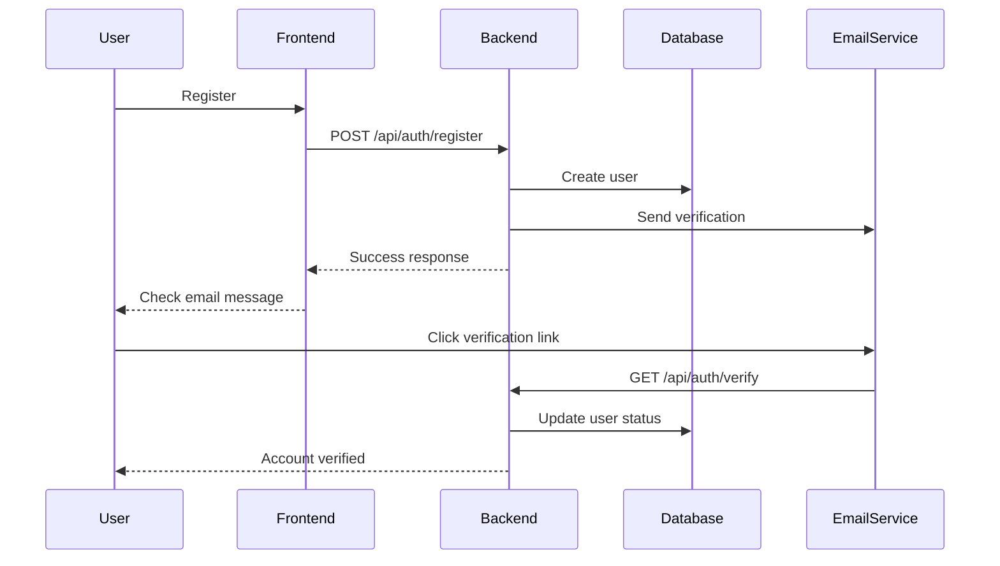
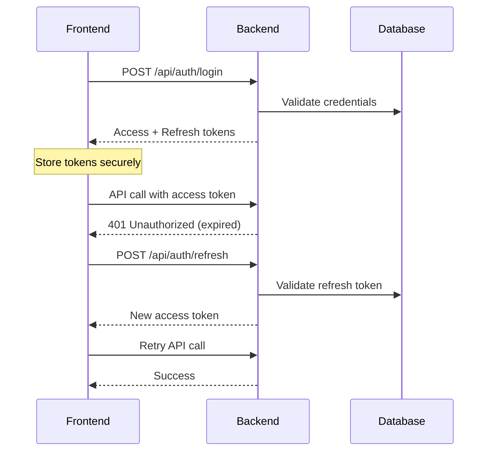

# GA4 Admin Automation System - Authentication & Authorization Specification

## Overview

This specification details the complete authentication and authorization system for the GA4 Admin Automation platform. It covers user registration, login, JWT token management, password security, session handling, and multi-factor authentication support.

## Features

### Core Authentication Features
- User registration with email verification
- Secure login/logout
- JWT access and refresh token system
- Password reset functionality
- Session management across devices
- Rate limiting and brute force protection
- Multi-factor authentication (planned)

### Authorization Features
- Role-based access control (RBAC)
- Resource-level permissions
- API endpoint protection
- Frontend route guards
- Permission inheritance

## Architecture

### Authentication Flow


### Token Management


## Database Models

### User Model
```sql
CREATE TABLE users (
    id UUID PRIMARY KEY DEFAULT gen_random_uuid(),
    email VARCHAR(255) UNIQUE NOT NULL,
    password_hash VARCHAR(255) NOT NULL,
    full_name VARCHAR(255) NOT NULL,
    role user_role NOT NULL DEFAULT 'requester',
    is_active BOOLEAN DEFAULT false,
    is_verified BOOLEAN DEFAULT false,
    last_login TIMESTAMP,
    failed_login_attempts INTEGER DEFAULT 0,
    locked_until TIMESTAMP,
    created_at TIMESTAMP DEFAULT CURRENT_TIMESTAMP,
    updated_at TIMESTAMP DEFAULT CURRENT_TIMESTAMP,
    
    -- Multi-tenant support
    client_id UUID REFERENCES clients(id),
    
    -- Profile information
    avatar_url VARCHAR(500),
    timezone VARCHAR(50) DEFAULT 'UTC',
    language VARCHAR(10) DEFAULT 'en',
    
    CONSTRAINT valid_email CHECK (email ~* '^[A-Za-z0-9._%+-]+@[A-Za-z0-9.-]+\.[A-Za-z]{2,}$')
);

CREATE TYPE user_role AS ENUM ('super_admin', 'admin', 'requester', 'ga_user');
```

### Session Model
```sql
CREATE TABLE user_sessions (
    id UUID PRIMARY KEY DEFAULT gen_random_uuid(),
    user_id UUID NOT NULL REFERENCES users(id) ON DELETE CASCADE,
    refresh_token_hash VARCHAR(255) NOT NULL,
    device_info JSONB,
    ip_address INET,
    user_agent TEXT,
    is_active BOOLEAN DEFAULT true,
    expires_at TIMESTAMP NOT NULL,
    created_at TIMESTAMP DEFAULT CURRENT_TIMESTAMP,
    last_used_at TIMESTAMP DEFAULT CURRENT_TIMESTAMP
);

CREATE INDEX idx_user_sessions_user_id ON user_sessions(user_id);
CREATE INDEX idx_user_sessions_expires_at ON user_sessions(expires_at);
```

### Password Reset Model
```sql
CREATE TABLE password_reset_tokens (
    id UUID PRIMARY KEY DEFAULT gen_random_uuid(),
    user_id UUID NOT NULL REFERENCES users(id) ON DELETE CASCADE,
    token_hash VARCHAR(255) NOT NULL,
    expires_at TIMESTAMP NOT NULL,
    used_at TIMESTAMP,
    created_at TIMESTAMP DEFAULT CURRENT_TIMESTAMP
);

CREATE INDEX idx_password_reset_tokens_user_id ON password_reset_tokens(user_id);
```

## Backend Implementation

### Authentication Service
```python
# src/services/auth_service.py
from datetime import datetime, timedelta
from typing import Optional, Tuple
import bcrypt
import jwt
from src.core.config import settings
from src.models.user import User
from src.schemas.auth import LoginCredentials, TokenPair

class AuthService:
    def __init__(self, user_repo, session_repo, email_service):
        self.user_repo = user_repo
        self.session_repo = session_repo
        self.email_service = email_service
    
    async def register_user(
        self, 
        email: str, 
        password: str, 
        full_name: str,
        client_id: Optional[str] = None
    ) -> User:
        """Register a new user"""
        # Check if user exists
        existing_user = await self.user_repo.get_by_email(email)
        if existing_user:
            raise ValueError("Email already registered")
        
        # Hash password
        password_hash = self._hash_password(password)
        
        # Create user
        user = await self.user_repo.create({
            "email": email,
            "password_hash": password_hash,
            "full_name": full_name,
            "client_id": client_id,
            "is_active": True,
            "is_verified": False
        })
        
        # Send verification email
        await self._send_verification_email(user)
        
        return user
    
    async def authenticate(
        self, 
        credentials: LoginCredentials,
        device_info: dict
    ) -> Tuple[User, TokenPair]:
        """Authenticate user and return tokens"""
        user = await self.user_repo.get_by_email(credentials.email)
        
        if not user or not self._verify_password(credentials.password, user.password_hash):
            await self._handle_failed_login(credentials.email)
            raise ValueError("Invalid credentials")
        
        if not user.is_active:
            raise ValueError("Account is deactivated")
        
        if not user.is_verified:
            raise ValueError("Please verify your email address")
        
        if user.locked_until and user.locked_until > datetime.utcnow():
            raise ValueError("Account is temporarily locked")
        
        # Reset failed attempts on successful login
        await self.user_repo.update(user.id, {
            "failed_login_attempts": 0,
            "locked_until": None,
            "last_login": datetime.utcnow()
        })
        
        # Generate tokens
        tokens = await self._create_tokens(user, device_info)
        
        return user, tokens
    
    async def refresh_tokens(
        self, 
        refresh_token: str,
        device_info: dict
    ) -> TokenPair:
        """Refresh access token using refresh token"""
        try:
            payload = jwt.decode(
                refresh_token,
                settings.JWT_SECRET_KEY,
                algorithms=[settings.JWT_ALGORITHM]
            )
        except jwt.ExpiredSignatureError:
            raise ValueError("Refresh token expired")
        except jwt.InvalidTokenError:
            raise ValueError("Invalid refresh token")
        
        user_id = payload.get("sub")
        session_id = payload.get("session_id")
        
        # Validate session
        session = await self.session_repo.get_active_session(user_id, session_id)
        if not session:
            raise ValueError("Invalid session")
        
        # Get user
        user = await self.user_repo.get_by_id(user_id)
        if not user or not user.is_active:
            raise ValueError("User not found or inactive")
        
        # Generate new tokens
        tokens = await self._create_tokens(user, device_info, session_id)
        
        return tokens
    
    async def logout(self, refresh_token: str) -> bool:
        """Logout user by invalidating session"""
        try:
            payload = jwt.decode(
                refresh_token,
                settings.JWT_SECRET_KEY,
                algorithms=[settings.JWT_ALGORITHM]
            )
            session_id = payload.get("session_id")
            
            # Deactivate session
            await self.session_repo.deactivate_session(session_id)
            return True
        except:
            return False
    
    def _hash_password(self, password: str) -> str:
        """Hash password using bcrypt"""
        salt = bcrypt.gensalt()
        return bcrypt.hashpw(password.encode('utf-8'), salt).decode('utf-8')
    
    def _verify_password(self, password: str, hash: str) -> bool:
        """Verify password against hash"""
        return bcrypt.checkpw(password.encode('utf-8'), hash.encode('utf-8'))
    
    async def _create_tokens(
        self, 
        user: User, 
        device_info: dict,
        session_id: Optional[str] = None
    ) -> TokenPair:
        """Create access and refresh tokens"""
        now = datetime.utcnow()
        
        # Create or update session
        if not session_id:
            session = await self.session_repo.create_session(
                user_id=user.id,
                device_info=device_info,
                expires_at=now + timedelta(days=settings.REFRESH_TOKEN_EXPIRE_DAYS)
            )
            session_id = session.id
        else:
            await self.session_repo.update_last_used(session_id)
        
        # Access token payload
        access_payload = {
            "sub": str(user.id),
            "email": user.email,
            "role": user.role,
            "client_id": str(user.client_id) if user.client_id else None,
            "iat": now,
            "exp": now + timedelta(minutes=settings.ACCESS_TOKEN_EXPIRE_MINUTES),
            "type": "access"
        }
        
        # Refresh token payload
        refresh_payload = {
            "sub": str(user.id),
            "session_id": str(session_id),
            "iat": now,
            "exp": now + timedelta(days=settings.REFRESH_TOKEN_EXPIRE_DAYS),
            "type": "refresh"
        }
        
        access_token = jwt.encode(
            access_payload,
            settings.JWT_SECRET_KEY,
            algorithm=settings.JWT_ALGORITHM
        )
        
        refresh_token = jwt.encode(
            refresh_payload,
            settings.JWT_SECRET_KEY,
            algorithm=settings.JWT_ALGORITHM
        )
        
        return TokenPair(
            access_token=access_token,
            refresh_token=refresh_token,
            token_type="bearer",
            expires_in=settings.ACCESS_TOKEN_EXPIRE_MINUTES * 60
        )
```

### API Endpoints
```python
# src/api/routers/auth.py
from fastapi import APIRouter, Depends, HTTPException, Request
from fastapi.security import HTTPBearer, HTTPAuthorizationCredentials
from src.services.auth_service import AuthService
from src.schemas.auth import *

router = APIRouter()
security = HTTPBearer()

@router.post("/register", response_model=UserResponse)
async def register(
    user_data: UserRegister,
    request: Request,
    auth_service: AuthService = Depends(get_auth_service)
) -> UserResponse:
    """Register a new user"""
    try:
        user = await auth_service.register_user(
            email=user_data.email,
            password=user_data.password,
            full_name=user_data.full_name,
            client_id=user_data.client_id
        )
        return UserResponse.from_orm(user)
    except ValueError as e:
        raise HTTPException(status_code=400, detail=str(e))

@router.post("/login", response_model=LoginResponse)
async def login(
    credentials: LoginCredentials,
    request: Request,
    auth_service: AuthService = Depends(get_auth_service)
) -> LoginResponse:
    """User login"""
    device_info = {
        "ip_address": request.client.host,
        "user_agent": request.headers.get("user-agent"),
        "device_type": detect_device_type(request.headers.get("user-agent"))
    }
    
    try:
        user, tokens = await auth_service.authenticate(credentials, device_info)
        return LoginResponse(
            user=UserResponse.from_orm(user),
            tokens=tokens
        )
    except ValueError as e:
        raise HTTPException(status_code=401, detail=str(e))

@router.post("/refresh", response_model=TokenPair)
async def refresh_token(
    token_data: RefreshTokenRequest,
    request: Request,
    auth_service: AuthService = Depends(get_auth_service)
) -> TokenPair:
    """Refresh access token"""
    device_info = {
        "ip_address": request.client.host,
        "user_agent": request.headers.get("user-agent")
    }
    
    try:
        tokens = await auth_service.refresh_tokens(
            token_data.refresh_token,
            device_info
        )
        return tokens
    except ValueError as e:
        raise HTTPException(status_code=401, detail=str(e))

@router.post("/logout")
async def logout(
    token_data: RefreshTokenRequest,
    auth_service: AuthService = Depends(get_auth_service)
) -> dict:
    """User logout"""
    await auth_service.logout(token_data.refresh_token)
    return {"message": "Logged out successfully"}

@router.get("/me", response_model=UserResponse)
async def get_current_user(
    current_user: User = Depends(get_current_active_user)
) -> UserResponse:
    """Get current user information"""
    return UserResponse.from_orm(current_user)

@router.post("/forgot-password")
async def forgot_password(
    request: ForgotPasswordRequest,
    auth_service: AuthService = Depends(get_auth_service)
) -> dict:
    """Send password reset email"""
    await auth_service.send_password_reset(request.email)
    return {"message": "Password reset email sent"}

@router.post("/reset-password")
async def reset_password(
    request: ResetPasswordRequest,
    auth_service: AuthService = Depends(get_auth_service)
) -> dict:
    """Reset password using token"""
    try:
        await auth_service.reset_password(request.token, request.new_password)
        return {"message": "Password reset successfully"}
    except ValueError as e:
        raise HTTPException(status_code=400, detail=str(e))
```

## Frontend Implementation

### Auth Context
```typescript
// src/contexts/auth-context.tsx
interface AuthContextType {
  user: User | null;
  isAuthenticated: boolean;
  isLoading: boolean;
  login: (credentials: LoginCredentials) => Promise<void>;
  logout: () => Promise<void>;
  register: (userData: RegisterData) => Promise<void>;
  refreshToken: () => Promise<void>;
}

export const AuthProvider: React.FC<{ children: React.ReactNode }> = ({ 
  children 
}) => {
  const [user, setUser] = useState<User | null>(null);
  const [isLoading, setIsLoading] = useState(true);
  
  const login = async (credentials: LoginCredentials) => {
    try {
      const response = await apiClient.post('/api/auth/login', credentials);
      const { user, tokens } = response.data;
      
      // Store tokens securely
      tokenStorage.setTokens(tokens);
      setUser(user);
      
      // Create audit log
      await apiClient.post('/api/audit', {
        action: 'login',
        resource_type: 'auth',
        details: { method: 'email_password' }
      });
      
      router.push('/dashboard');
    } catch (error) {
      throw new Error('Login failed');
    }
  };
  
  const logout = async () => {
    try {
      const refreshToken = tokenStorage.getRefreshToken();
      if (refreshToken) {
        await apiClient.post('/api/auth/logout', { refresh_token: refreshToken });
      }
    } finally {
      tokenStorage.clearTokens();
      setUser(null);
      router.push('/login');
    }
  };
  
  const refreshToken = async () => {
    try {
      const refreshToken = tokenStorage.getRefreshToken();
      if (!refreshToken) {
        throw new Error('No refresh token');
      }
      
      const response = await apiClient.post('/api/auth/refresh', {
        refresh_token: refreshToken
      });
      
      tokenStorage.setTokens(response.data);
    } catch (error) {
      await logout();
    }
  };
  
  // Check authentication on app load
  useEffect(() => {
    const checkAuth = async () => {
      const accessToken = tokenStorage.getAccessToken();
      
      if (accessToken && !isTokenExpired(accessToken)) {
        try {
          const response = await apiClient.get('/api/auth/me');
          setUser(response.data);
        } catch (error) {
          await refreshToken();
        }
      }
      
      setIsLoading(false);
    };
    
    checkAuth();
  }, []);
  
  return (
    <AuthContext.Provider value={{
      user,
      isAuthenticated: !!user,
      isLoading,
      login,
      logout,
      register,
      refreshToken
    }}>
      {children}
    </AuthContext.Provider>
  );
};
```

### Auth Components
```typescript
// src/components/auth/LoginForm.tsx
export function LoginForm() {
  const { login } = useAuth();
  const [isLoading, setIsLoading] = useState(false);
  
  const form = useForm<LoginCredentials>({
    resolver: zodResolver(loginSchema),
    defaultValues: {
      email: '',
      password: ''
    }
  });
  
  const onSubmit = async (data: LoginCredentials) => {
    setIsLoading(true);
    try {
      await login(data);
      toast.success('Logged in successfully');
    } catch (error) {
      toast.error('Invalid email or password');
    } finally {
      setIsLoading(false);
    }
  };
  
  return (
    <Card className="w-full max-w-md mx-auto">
      <CardHeader>
        <CardTitle>Sign In</CardTitle>
        <CardDescription>
          Enter your credentials to access your account
        </CardDescription>
      </CardHeader>
      
      <CardContent>
        <Form {...form}>
          <form onSubmit={form.handleSubmit(onSubmit)} className="space-y-4">
            <FormField
              control={form.control}
              name="email"
              render={({ field }) => (
                <FormItem>
                  <FormLabel>Email</FormLabel>
                  <FormControl>
                    <Input 
                      type="email" 
                      placeholder="Enter your email" 
                      {...field} 
                    />
                  </FormControl>
                  <FormMessage />
                </FormItem>
              )}
            />
            
            <FormField
              control={form.control}
              name="password"
              render={({ field }) => (
                <FormItem>
                  <FormLabel>Password</FormLabel>
                  <FormControl>
                    <Input 
                      type="password" 
                      placeholder="Enter your password" 
                      {...field} 
                    />
                  </FormControl>
                  <FormMessage />
                </FormItem>
              )}
            />
            
            <Button type="submit" className="w-full" disabled={isLoading}>
              {isLoading && <Loader2 className="mr-2 h-4 w-4 animate-spin" />}
              Sign In
            </Button>
          </form>
        </Form>
      </CardContent>
      
      <CardFooter className="flex flex-col space-y-2">
        <Link href="/forgot-password" className="text-sm text-muted-foreground hover:underline">
          Forgot your password?
        </Link>
        <div className="text-sm text-muted-foreground">
          Don't have an account?{' '}
          <Link href="/register" className="hover:underline">
            Sign up
          </Link>
        </div>
      </CardFooter>
    </Card>
  );
}
```

### Protected Route Component
```typescript
// src/components/auth/ProtectedRoute.tsx
interface ProtectedRouteProps {
  children: React.ReactNode;
  requiredRole?: UserRole;
  requiredPermissions?: string[];
}

export function ProtectedRoute({
  children,
  requiredRole,
  requiredPermissions
}: ProtectedRouteProps) {
  const { user, isAuthenticated, isLoading } = useAuth();
  const router = useRouter();
  
  useEffect(() => {
    if (!isLoading && !isAuthenticated) {
      router.push('/login');
      return;
    }
    
    if (user && requiredRole && !hasRole(user, requiredRole)) {
      router.push('/unauthorized');
      return;
    }
    
    if (user && requiredPermissions && !hasPermissions(user, requiredPermissions)) {
      router.push('/unauthorized');
      return;
    }
  }, [user, isAuthenticated, isLoading]);
  
  if (isLoading) {
    return <LoadingSpinner />;
  }
  
  if (!isAuthenticated) {
    return null;
  }
  
  return <>{children}</>;
}
```

## Security Implementation

### Rate Limiting
```python
# src/middleware/rate_limiting.py
from fastapi import Request, HTTPException
from slowapi import Limiter, _rate_limit_exceeded_handler
from slowapi.util import get_remote_address

limiter = Limiter(key_func=get_remote_address)

@limiter.limit("5/minute")
async def login_rate_limit(request: Request):
    """Rate limit for login attempts"""
    pass

@limiter.limit("10/minute")
async def password_reset_rate_limit(request: Request):
    """Rate limit for password reset requests"""
    pass
```

### Password Security
```python
# src/utils/password.py
import re
from typing import List

class PasswordValidator:
    @staticmethod
    def validate_password_strength(password: str) -> List[str]:
        """Validate password strength and return list of issues"""
        issues = []
        
        if len(password) < 8:
            issues.append("Password must be at least 8 characters long")
        
        if not re.search(r'[A-Z]', password):
            issues.append("Password must contain at least one uppercase letter")
        
        if not re.search(r'[a-z]', password):
            issues.append("Password must contain at least one lowercase letter")
        
        if not re.search(r'\d', password):
            issues.append("Password must contain at least one digit")
        
        if not re.search(r'[!@#$%^&*(),.?":{}|<>]', password):
            issues.append("Password must contain at least one special character")
        
        return issues
    
    @staticmethod
    def is_common_password(password: str) -> bool:
        """Check if password is in common passwords list"""
        common_passwords = {
            'password', '123456', 'password123', 'admin', 'qwerty',
            'letmein', 'welcome', 'monkey', '1234567890'
        }
        return password.lower() in common_passwords
```

## Implementation Phases

### Phase 1: Basic Authentication (Week 1)
**Time Estimate**: 40 hours
**Agent**: Backend Agent 8

#### Tasks:
1. **Database Setup** (Day 1)
   - Create user table
   - Setup migrations
   - Create test data
   - **Git Commit**: Every 30 minutes

2. **JWT Implementation** (Day 2)
   - JWT utility functions
   - Token creation/validation
   - Middleware setup
   - **Git Commit**: Every 30 minutes

3. **Authentication API** (Day 3-4)
   - Register endpoint
   - Login endpoint
   - Token refresh endpoint
   - Logout endpoint
   - **Git Commit**: Every 30 minutes

4. **Security Measures** (Day 5)
   - Password hashing
   - Rate limiting
   - Input validation
   - **Git Commit**: Every 30 minutes

**Success Criteria**:
- ✓ Users can register and login
- ✓ JWT tokens work correctly
- ✓ Security measures active
- ✓ API tests passing

**QA Checkpoints**:
- [ ] Password hashing secure
- [ ] Tokens validate properly
- [ ] Rate limiting works
- [ ] Input validation complete

### Phase 2: Frontend Integration (Week 2)
**Time Estimate**: 40 hours
**Agent**: Frontend Agent 2

#### Tasks:
1. **Auth Context** (Day 6)
   - Authentication state management
   - Token storage
   - Auto-refresh logic
   - **Git Commit**: Every 30 minutes

2. **Auth Forms** (Day 7-8)
   - Login form
   - Registration form
   - Password reset form
   - Form validation
   - **Git Commit**: Every 30 minutes

3. **Route Protection** (Day 9)
   - Protected route wrapper
   - Role-based access
   - Redirect logic
   - **Git Commit**: Every 30 minutes

4. **Integration Testing** (Day 10)
   - E2E auth flow
   - Error handling
   - Session persistence
   - **Git Commit**: Every 30 minutes

**Success Criteria**:
- ✓ Complete auth flow working
- ✓ Session persistence works
- ✓ Route protection active
- ✓ Error handling complete

**QA Checkpoints**:
- [ ] Login flow smooth
- [ ] Session maintained across tabs
- [ ] Protected routes secure
- [ ] Error messages clear

### Phase 3: Advanced Features (Week 3)
**Time Estimate**: 40 hours
**Agent**: Backend Agent 8 & Frontend Agent 2

#### Tasks:
1. **Session Management** (Day 11-12)
   - Multi-device sessions
   - Session listing
   - Session termination
   - **Git Commit**: Every 30 minutes

2. **Password Reset** (Day 13)
   - Password reset flow
   - Email integration
   - Token validation
   - **Git Commit**: Every 30 minutes

3. **Account Management** (Day 14)
   - Profile updates
   - Password changes
   - Account deactivation
   - **Git Commit**: Every 30 minutes

4. **Security Enhancements** (Day 15)
   - Brute force protection
   - Account lockout
   - Security logging
   - **Git Commit**: Every 30 minutes

**Success Criteria**:
- ✓ Password reset working
- ✓ Session management complete
- ✓ Security features active
- ✓ Account management functional

**QA Checkpoints**:
- [ ] Password reset secure
- [ ] Session management works
- [ ] Security measures effective
- [ ] Account features complete

## Common Error Patterns & Solutions

### 1. Token Synchronization Issues
**Problem**: Tokens out of sync between tabs
**Solution**: Use broadcast channel API for cross-tab synchronization

### 2. Token Refresh Race Conditions
**Problem**: Multiple refresh requests simultaneously
**Solution**: Implement request queuing and token refresh mutex

### 3. Session Fixation
**Problem**: Session ID not regenerated after login
**Solution**: Generate new session ID on authentication

### 4. Insecure Token Storage
**Problem**: Tokens stored in localStorage
**Solution**: Use httpOnly cookies or secure storage

## Testing Requirements

### Unit Tests
- Password hashing/verification
- JWT token creation/validation
- Rate limiting logic
- Session management

### Integration Tests
- Complete auth flow
- Token refresh cycle
- Password reset flow
- Session termination

### Security Tests
- Brute force protection
- Token tampering detection
- Session hijacking prevention
- Password strength validation

### E2E Tests
- User registration flow
- Login/logout cycle
- Password reset process
- Multi-device sessions

## Agent Responsibilities

### Backend Agent 8 - Security & Auth
- JWT implementation
- Password security
- Session management
- Security middleware
- Rate limiting
- Audit logging

### Frontend Agent 2 - State Management
- Auth context
- Token management
- Session persistence
- Route guards
- Error handling

## Monitoring & Metrics

### Key Metrics
- Login success/failure rates
- Token refresh frequency
- Password reset requests
- Account lockouts
- Session durations

### Security Alerts
- Multiple failed login attempts
- Suspicious login locations
- Token tampering attempts
- Account enumeration attempts

---

**Document Version**: 1.0.0  
**Last Updated**: 2024-01-20  
**Dependencies**: main-spec.md, backend-spec.md, frontend-spec.md