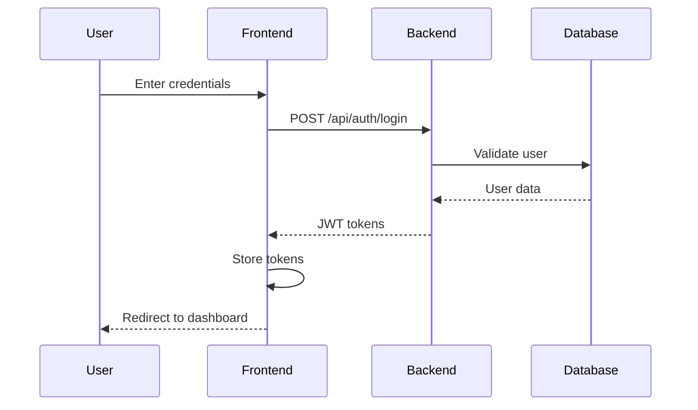

# GA4 Admin Automation System - Integration Specification

## Overview

This specification defines how the frontend and backend components of the GA4 Admin Automation System communicate and integrate. It covers API contracts, authentication flow, real-time updates, error handling, and data synchronization strategies.

## API Communication Architecture

### Communication Flow
```
┌─────────────────┐     HTTPS/WSS    ┌─────────────────┐
│                 │ ←───────────────→ │                 │
│   Next.js App   │                   │  FastAPI Server │
│                 │ ←───────────────→ │                 │
└─────────────────┘    JSON/REST      └─────────────────┘
         ↑                                      ↑
         │               Redis                  │
         └──────────────  Cache ────────────────┘
```

### API Client Configuration

#### Frontend API Client
```typescript
// frontend/src/lib/api-client.ts
export class APIClient {
  private baseURL: string;
  private accessToken: string | null = null;
  private refreshToken: string | null = null;

  constructor() {
    this.baseURL = process.env.NEXT_PUBLIC_API_URL || 'http://localhost:8000';
    this.loadTokens();
  }

  async request<T>(
    endpoint: string,
    options: RequestOptions = {}
  ): Promise<APIResponse<T>> {
    const url = `${this.baseURL}${endpoint}`;
    
    try {
      const response = await fetch(url, {
        ...options,
        headers: {
          'Content-Type': 'application/json',
          'Authorization': this.accessToken ? `Bearer ${this.accessToken}` : '',
          ...options.headers,
        },
      });

      if (response.status === 401) {
        await this.handleTokenRefresh();
        return this.request<T>(endpoint, options);
      }

      const data = await response.json();
      
      if (!response.ok) {
        throw new APIError(data.error);
      }

      return { data, error: null };
    } catch (error) {
      return { data: null, error };
    }
  }
}
```

#### Backend CORS Configuration
```python
# backend/src/core/config.py
CORS_ORIGINS = [
    "http://localhost:3000",
    "https://app.ga4admin.com",
]

# backend/src/main.py
app.add_middleware(
    CORSMiddleware,
    allow_origins=CORS_ORIGINS,
    allow_credentials=True,
    allow_methods=["*"],
    allow_headers=["*"],
)
```

## Authentication Integration

### Login Flow


### Token Management

#### Frontend Token Storage
```typescript
// frontend/src/stores/auth-store.ts
interface AuthStore {
  accessToken: string | null;
  refreshToken: string | null;
  user: User | null;

  setTokens(tokens: TokenPair): void {
    this.accessToken = tokens.access_token;
    this.refreshToken = tokens.refresh_token;
    
    // Store in secure httpOnly cookies
    document.cookie = `access_token=${tokens.access_token}; Secure; SameSite=Strict`;
    document.cookie = `refresh_token=${tokens.refresh_token}; Secure; SameSite=Strict`;
    
    // Decode and store user info
    this.user = decodeJWT(tokens.access_token);
  }

  async refreshAccessToken(): Promise<void> {
    const response = await apiClient.post('/api/auth/refresh', {
      refresh_token: this.refreshToken
    });
    
    if (response.data) {
      this.setTokens(response.data);
    }
  }
}
```

#### Backend Token Validation
```python
# backend/src/api/dependencies/auth.py
async def get_current_user(
    token: str = Depends(oauth2_scheme),
    db: AsyncSession = Depends(get_db)
) -> User:
    try:
        payload = jwt.decode(
            token, 
            settings.JWT_SECRET_KEY, 
            algorithms=[settings.JWT_ALGORITHM]
        )
        user_id = payload.get("sub")
        
        if not user_id:
            raise credentials_exception
            
        user = await user_service.get_by_id(db, user_id)
        
        if not user:
            raise credentials_exception
            
        return user
    except JWTError:
        raise credentials_exception
```

## API Contracts

### Standard Response Format

#### Success Response
```json
{
  "data": {
    "id": "uuid",
    "email": "user@example.com",
    "role": "admin"
  },
  "meta": {
    "timestamp": "2024-01-20T10:00:00Z",
    "version": "1.0.0"
  }
}
```

#### Error Response
```json
{
  "error": {
    "code": "VALIDATION_ERROR",
    "message": "Invalid email format",
    "details": {
      "field": "email",
      "constraint": "email"
    }
  },
  "meta": {
    "timestamp": "2024-01-20T10:00:00Z",
    "request_id": "req_123456"
  }
}
```

#### Paginated Response
```json
{
  "data": [
    { "id": "1", "name": "Item 1" },
    { "id": "2", "name": "Item 2" }
  ],
  "pagination": {
    "page": 1,
    "per_page": 20,
    "total": 100,
    "pages": 5
  },
  "meta": {
    "timestamp": "2024-01-20T10:00:00Z"
  }
}
```

### Core API Endpoints

#### Authentication Endpoints
```yaml
POST /api/auth/register:
  request:
    email: string
    password: string
    full_name: string
  response:
    user: User
    tokens: TokenPair

POST /api/auth/login:
  request:
    email: string
    password: string
  response:
    user: User
    tokens: TokenPair

POST /api/auth/refresh:
  request:
    refresh_token: string
  response:
    tokens: TokenPair

POST /api/auth/logout:
  request:
    refresh_token: string
  response:
    message: string
```

#### User Management Endpoints
```yaml
GET /api/users:
  query:
    page: number
    per_page: number
    role: UserRole
    search: string
  response:
    data: User[]
    pagination: Pagination

GET /api/users/{user_id}:
  response:
    data: User

PUT /api/users/{user_id}:
  request:
    full_name?: string
    role?: UserRole
    is_active?: boolean
  response:
    data: User

DELETE /api/users/{user_id}:
  response:
    message: string
```

#### Permission Management Endpoints
```yaml
POST /api/permissions:
  request:
    ga4_property_id: string
    ga4_account_id: string
    permission_type: PermissionType
    reason: string
  response:
    data: Permission

GET /api/permissions:
  query:
    status: PermissionStatus
    user_id: UUID
    page: number
  response:
    data: Permission[]
    pagination: Pagination

POST /api/permissions/{id}/approve:
  request:
    expires_at: datetime
    notes: string
  response:
    data: Permission

POST /api/permissions/{id}/reject:
  request:
    reason: string
  response:
    data: Permission
```

## Real-time Communication

### WebSocket Connection

#### Frontend WebSocket Client
```typescript
// frontend/src/lib/websocket-client.ts
export class WebSocketClient {
  private ws: WebSocket | null = null;
  private reconnectInterval = 5000;
  private listeners: Map<string, Set<Function>> = new Map();

  connect(token: string) {
    const wsUrl = process.env.NEXT_PUBLIC_WS_URL || 'ws://localhost:8000/ws';
    
    this.ws = new WebSocket(`${wsUrl}?token=${token}`);
    
    this.ws.onopen = () => {
      console.log('WebSocket connected');
      this.emit('connected');
    };
    
    this.ws.onmessage = (event) => {
      const message = JSON.parse(event.data);
      this.emit(message.type, message.data);
    };
    
    this.ws.onclose = () => {
      setTimeout(() => this.reconnect(token), this.reconnectInterval);
    };
  }

  on(event: string, callback: Function) {
    if (!this.listeners.has(event)) {
      this.listeners.set(event, new Set());
    }
    this.listeners.get(event)!.add(callback);
  }

  emit(event: string, data?: any) {
    const callbacks = this.listeners.get(event);
    if (callbacks) {
      callbacks.forEach(cb => cb(data));
    }
  }
}
```

#### Backend WebSocket Handler
```python
# backend/src/api/websockets/handlers.py
class ConnectionManager:
    def __init__(self):
        self.active_connections: Dict[str, WebSocket] = {}
    
    async def connect(self, websocket: WebSocket, user_id: str):
        await websocket.accept()
        self.active_connections[user_id] = websocket
    
    def disconnect(self, user_id: str):
        if user_id in self.active_connections:
            del self.active_connections[user_id]
    
    async def send_personal_message(self, message: dict, user_id: str):
        if user_id in self.active_connections:
            await self.active_connections[user_id].send_json(message)
    
    async def broadcast(self, message: dict, exclude_user: str = None):
        for user_id, connection in self.active_connections.items():
            if user_id != exclude_user:
                await connection.send_json(message)

@app.websocket("/ws")
async def websocket_endpoint(
    websocket: WebSocket,
    token: str = Query(...),
    db: AsyncSession = Depends(get_db)
):
    user = await verify_token(token, db)
    
    if not user:
        await websocket.close(code=4001)
        return
    
    await manager.connect(websocket, str(user.id))
    
    try:
        while True:
            data = await websocket.receive_json()
            # Handle incoming messages
    except WebSocketDisconnect:
        manager.disconnect(str(user.id))
```

### Real-time Events

#### Event Types
```typescript
// frontend/src/types/websocket.ts
export enum WebSocketEventType {
  // Notifications
  NOTIFICATION_NEW = 'notification:new',
  NOTIFICATION_READ = 'notification:read',
  
  // Permissions
  PERMISSION_REQUESTED = 'permission:requested',
  PERMISSION_APPROVED = 'permission:approved',
  PERMISSION_REJECTED = 'permission:rejected',
  PERMISSION_EXPIRED = 'permission:expired',
  
  // Users
  USER_ONLINE = 'user:online',
  USER_OFFLINE = 'user:offline',
  USER_UPDATED = 'user:updated',
  
  // System
  SYSTEM_ANNOUNCEMENT = 'system:announcement',
  SYSTEM_MAINTENANCE = 'system:maintenance',
}
```

## Data Synchronization

### Optimistic Updates

#### Frontend Implementation
```typescript
// frontend/src/hooks/useOptimisticUpdate.ts
export function useOptimisticUpdate<T>() {
  const queryClient = useQueryClient();
  
  return useMutation({
    mutationFn: async (data: T) => {
      // Optimistically update cache
      queryClient.setQueryData(['key'], (old) => {
        return { ...old, ...data };
      });
      
      // Make API call
      const response = await apiClient.put('/api/resource', data);
      
      return response.data;
    },
    onError: (err, variables, context) => {
      // Rollback on error
      queryClient.setQueryData(['key'], context.previousData);
    },
    onSettled: () => {
      // Refetch to ensure consistency
      queryClient.invalidateQueries(['key']);
    },
  });
}
```

### Cache Invalidation

#### Frontend Cache Strategy
```typescript
// frontend/src/lib/cache-config.ts
export const cacheConfig = {
  users: {
    staleTime: 5 * 60 * 1000, // 5 minutes
    cacheTime: 10 * 60 * 1000, // 10 minutes
  },
  permissions: {
    staleTime: 1 * 60 * 1000, // 1 minute
    cacheTime: 5 * 60 * 1000, // 5 minutes
  },
  ga4Data: {
    staleTime: 15 * 60 * 1000, // 15 minutes
    cacheTime: 30 * 60 * 1000, // 30 minutes
  },
};

// Invalidation on updates
export const invalidateRelatedQueries = (resource: string) => {
  const queryClient = useQueryClient();
  
  switch (resource) {
    case 'user':
      queryClient.invalidateQueries(['users']);
      queryClient.invalidateQueries(['permissions']);
      break;
    case 'permission':
      queryClient.invalidateQueries(['permissions']);
      queryClient.invalidateQueries(['analytics']);
      break;
  }
};
```

#### Backend Cache Strategy
```python
# backend/src/core/cache.py
class CacheService:
    def __init__(self, redis: Redis):
        self.redis = redis
    
    async def get(self, key: str) -> Optional[Any]:
        value = await self.redis.get(key)
        return json.loads(value) if value else None
    
    async def set(self, key: str, value: Any, ttl: int = 300):
        await self.redis.setex(
            key, 
            ttl, 
            json.dumps(value, default=str)
        )
    
    async def invalidate(self, pattern: str):
        keys = await self.redis.keys(pattern)
        if keys:
            await self.redis.delete(*keys)

# Usage in API
@router.get("/users")
async def list_users(
    cache: CacheService = Depends(get_cache),
    db: AsyncSession = Depends(get_db)
):
    cache_key = "users:list"
    cached = await cache.get(cache_key)
    
    if cached:
        return cached
    
    users = await user_service.list_users(db)
    await cache.set(cache_key, users, ttl=300)
    
    return users
```

## Error Handling

### Frontend Error Handling

#### Global Error Handler
```typescript
// frontend/src/lib/error-handler.ts
export class ErrorHandler {
  static handle(error: any): ErrorResponse {
    if (error instanceof APIError) {
      return {
        type: 'api',
        code: error.code,
        message: error.message,
        details: error.details,
      };
    }
    
    if (error instanceof NetworkError) {
      return {
        type: 'network',
        message: 'Network connection failed',
        retry: true,
      };
    }
    
    return {
      type: 'unknown',
      message: 'An unexpected error occurred',
    };
  }
  
  static async handleWithRetry(
    fn: () => Promise<any>,
    retries: number = 3
  ): Promise<any> {
    for (let i = 0; i < retries; i++) {
      try {
        return await fn();
      } catch (error) {
        if (i === retries - 1) throw error;
        await new Promise(r => setTimeout(r, 1000 * Math.pow(2, i)));
      }
    }
  }
}
```

#### Component Error Boundary
```typescript
// frontend/src/components/ErrorBoundary.tsx
export class ErrorBoundary extends React.Component {
  state = { hasError: false, error: null };
  
  static getDerivedStateFromError(error: Error) {
    return { hasError: true, error };
  }
  
  componentDidCatch(error: Error, info: ErrorInfo) {
    // Log to error tracking service
    console.error('Component error:', error, info);
  }
  
  render() {
    if (this.state.hasError) {
      return <ErrorFallback error={this.state.error} />;
    }
    
    return this.props.children;
  }
}
```

### Backend Error Handling

#### Exception Handlers
```python
# backend/src/core/exceptions.py
@app.exception_handler(ValidationError)
async def validation_exception_handler(
    request: Request,
    exc: ValidationError
):
    return JSONResponse(
        status_code=400,
        content={
            "error": {
                "code": "VALIDATION_ERROR",
                "message": str(exc),
                "details": exc.errors() if hasattr(exc, 'errors') else None
            }
        }
    )

@app.exception_handler(HTTPException)
async def http_exception_handler(
    request: Request,
    exc: HTTPException
):
    return JSONResponse(
        status_code=exc.status_code,
        content={
            "error": {
                "code": exc.status_code,
                "message": exc.detail
            }
        }
    )
```

## File Upload Integration

### Frontend Upload Component
```typescript
// frontend/src/components/FileUpload.tsx
export function FileUpload({ onUpload }: FileUploadProps) {
  const uploadFile = async (file: File) => {
    const formData = new FormData();
    formData.append('file', file);
    
    const response = await fetch('/api/upload', {
      method: 'POST',
      headers: {
        'Authorization': `Bearer ${getAccessToken()}`,
      },
      body: formData,
    });
    
    if (!response.ok) {
      throw new Error('Upload failed');
    }
    
    return response.json();
  };
  
  return (
    <Upload
      accept=".json,.csv"
      maxSize={10 * 1024 * 1024} // 10MB
      onDrop={uploadFile}
    />
  );
}
```

### Backend File Handler
```python
# backend/src/api/routers/upload.py
@router.post("/upload")
async def upload_file(
    file: UploadFile = File(...),
    current_user: User = Depends(get_current_user),
    db: AsyncSession = Depends(get_db)
):
    # Validate file
    if file.size > 10 * 1024 * 1024:  # 10MB
        raise HTTPException(400, "File too large")
    
    # Save file
    file_path = f"uploads/{current_user.id}/{file.filename}"
    
    async with aiofiles.open(file_path, 'wb') as f:
        content = await file.read()
        await f.write(content)
    
    # Create database record
    file_record = await file_service.create_file_record(
        db,
        user_id=current_user.id,
        filename=file.filename,
        path=file_path,
        size=file.size
    )
    
    return {"file_id": str(file_record.id)}
```

## Testing Integration

### Integration Test Setup
```typescript
// frontend/tests/integration/auth.test.ts
describe('Authentication Flow', () => {
  it('should login and access protected route', async () => {
    // Mock API responses
    mockServer.use(
      rest.post('/api/auth/login', (req, res, ctx) => {
        return res(ctx.json({
          user: mockUser,
          tokens: mockTokens,
        }));
      })
    );
    
    // Render login page
    render(<LoginPage />);
    
    // Fill form
    await userEvent.type(screen.getByLabelText('Email'), 'test@example.com');
    await userEvent.type(screen.getByLabelText('Password'), 'password');
    
    // Submit
    await userEvent.click(screen.getByRole('button', { name: 'Login' }));
    
    // Verify redirect
    await waitFor(() => {
      expect(mockRouter.push).toHaveBeenCalledWith('/dashboard');
    });
  });
});
```

### E2E Test Example
```typescript
// e2e/tests/permission-flow.spec.ts
test('complete permission request flow', async ({ page }) => {
  // Login
  await page.goto('/login');
  await page.fill('[name="email"]', 'admin@example.com');
  await page.fill('[name="password"]', 'password');
  await page.click('button[type="submit"]');
  
  // Navigate to permissions
  await page.click('text=Permissions');
  
  // Request new permission
  await page.click('text=Request Permission');
  await page.selectOption('[name="property"]', 'property-123');
  await page.fill('[name="reason"]', 'Need access for client work');
  await page.click('text=Submit Request');
  
  // Verify success
  await expect(page.locator('.toast')).toContainText('Permission requested');
});
```

## Performance Optimization

### API Response Compression
```python
# backend/src/main.py
from fastapi.middleware.gzip import GZipMiddleware

app.add_middleware(GZipMiddleware, minimum_size=1000)
```

### Frontend Bundle Optimization
```typescript
// next.config.js
module.exports = {
  webpack: (config, { isServer }) => {
    if (!isServer) {
      config.optimization.splitChunks = {
        chunks: 'all',
        cacheGroups: {
          default: false,
          vendors: false,
          vendor: {
            name: 'vendor',
            chunks: 'all',
            test: /node_modules/,
          },
          common: {
            name: 'common',
            minChunks: 2,
            chunks: 'all',
            priority: 10,
            reuseExistingChunk: true,
            enforce: true,
          },
        },
      };
    }
    return config;
  },
};
```

## Security Considerations

### API Security Headers
```python
# backend/src/middleware/security.py
@app.middleware("http")
async def add_security_headers(request: Request, call_next):
    response = await call_next(request)
    response.headers["X-Content-Type-Options"] = "nosniff"
    response.headers["X-Frame-Options"] = "DENY"
    response.headers["X-XSS-Protection"] = "1; mode=block"
    response.headers["Strict-Transport-Security"] = "max-age=31536000"
    return response
```

### Frontend Security Measures
```typescript
// frontend/src/lib/security.ts
export const sanitizeInput = (input: string): string => {
  return DOMPurify.sanitize(input, {
    ALLOWED_TAGS: ['b', 'i', 'em', 'strong'],
    ALLOWED_ATTR: [],
  });
};

export const validateCSRFToken = (token: string): boolean => {
  const storedToken = sessionStorage.getItem('csrf_token');
  return token === storedToken;
};
```

## Monitoring Integration

### Frontend Monitoring
```typescript
// frontend/src/lib/monitoring.ts
export class Monitor {
  static logError(error: Error, context?: any) {
    // Send to monitoring service
    console.error('Application error:', error, context);
  }
  
  static trackEvent(event: string, properties?: any) {
    // Send to analytics
    console.log('Event:', event, properties);
  }
  
  static measurePerformance(name: string, fn: () => Promise<any>) {
    const start = performance.now();
    
    return fn().finally(() => {
      const duration = performance.now() - start;
      console.log(`${name} took ${duration}ms`);
    });
  }
}
```

### Backend Monitoring
```python
# backend/src/middleware/monitoring.py
@app.middleware("http")
async def log_requests(request: Request, call_next):
    start_time = time.time()
    
    response = await call_next(request)
    
    process_time = time.time() - start_time
    
    logger.info(
        f"Request: {request.method} {request.url.path} "
        f"Status: {response.status_code} "
        f"Duration: {process_time:.3f}s"
    )
    
    return response
```

## Common Integration Issues & Solutions

### 1. CORS Issues
**Problem**: Blocked by CORS policy
**Solution**: Ensure backend CORS middleware is properly configured

### 2. Token Synchronization
**Problem**: Tokens out of sync between tabs
**Solution**: Use broadcast channel API or shared worker

### 3. WebSocket Reconnection
**Problem**: WebSocket disconnects frequently
**Solution**: Implement exponential backoff reconnection

### 4. Large Payload Handling
**Problem**: API timeouts with large responses
**Solution**: Implement pagination and response streaming

---

**Document Version**: 1.0.0  
**Last Updated**: 2024-01-20  
**Dependencies**: frontend-spec.md, backend-spec.md